# Предназначение каждого файла

## 1) **testing_np_linalg_eig.ipynb**
>  Во время тестрирования своих алгоритмов, я построил график который показывал величину найденного собственного числа в соответстивии с его индексом. Была замечени странность - несколько чисел были в 1000-10000 раз больше всех остальных собственных чисел на практически любой исследуемой матрицей. Посоветовавшись с Дегятревым А.Б. и Утешевым А.Ю., я решил перепроверить правильность написания кода. Действительно, несколько собственных чисел большинства матриц (заданных случайно) по модулю больше на несколько порядков всего отсального множества. Данный файл подтверждает это наблюдение.

  
  

## 2) **qr_algos_battle.ipynb**
> Во время первоначального тестирования, было обнаружено, что на больших матрицах алгоритмы, которые находят сразу все собственные числа работают лучше. Поэтому я решил болле подробно изучить QR-алгоритм, основной частью которого является QR-разложение. При изучении, было обнаружено 5 разных алгоритмов QR-разложения:
> 
>   1) Стандартный алгоритм ортогонализации Грама-Шмидта - *basic_QR*
>   2) Оптимизированный алгоритм ортогонализации Грама-Шмидта (основной задачей является предотвращение потери точности при процессе вычитания $\vec{u_i} - \sum_{j=1}^i \vec{u_j}$) - *Gram_Schmidt_optimised_QR*
>   3) Оптимизированный алгоритм ортогонализации Грама-Шмидта модификации Першина А.Ю. - *qr_pershin*
>   4) Метод Хаусхолдера (метод отражений) - *qr_householder*
>   5) QR-декомпозиция с помощью вращений по Гивенсу - *qr_givens*
>

### Матрицы, на которых прогонялись алгоритмы

  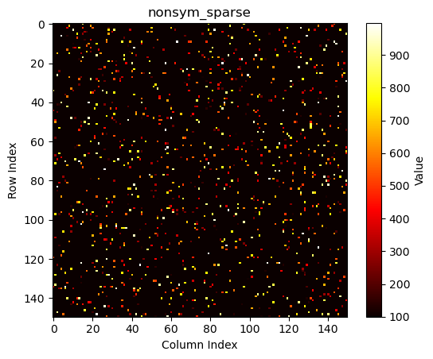
    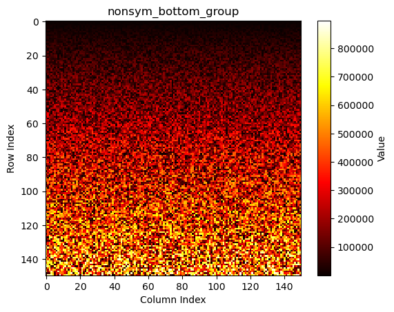
    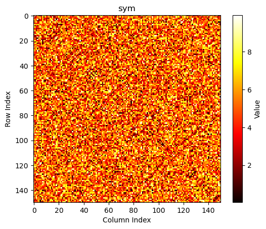
    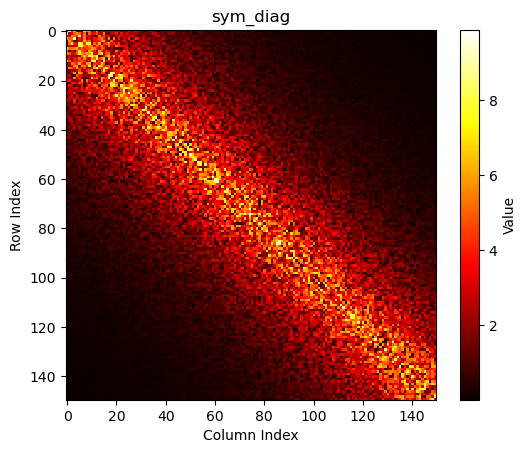
    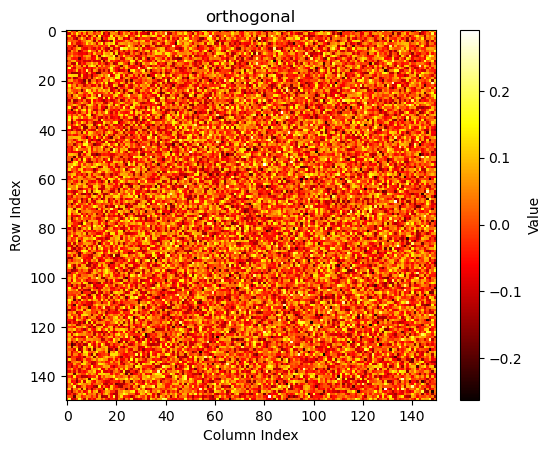
    
    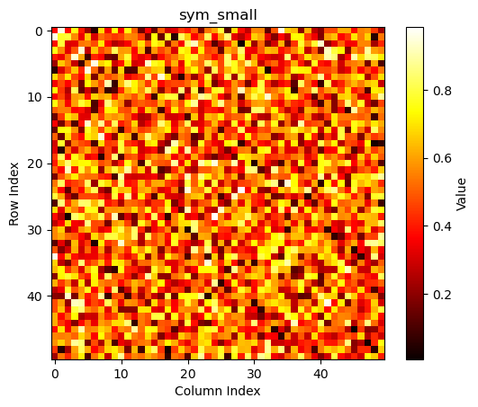

### Результаты

  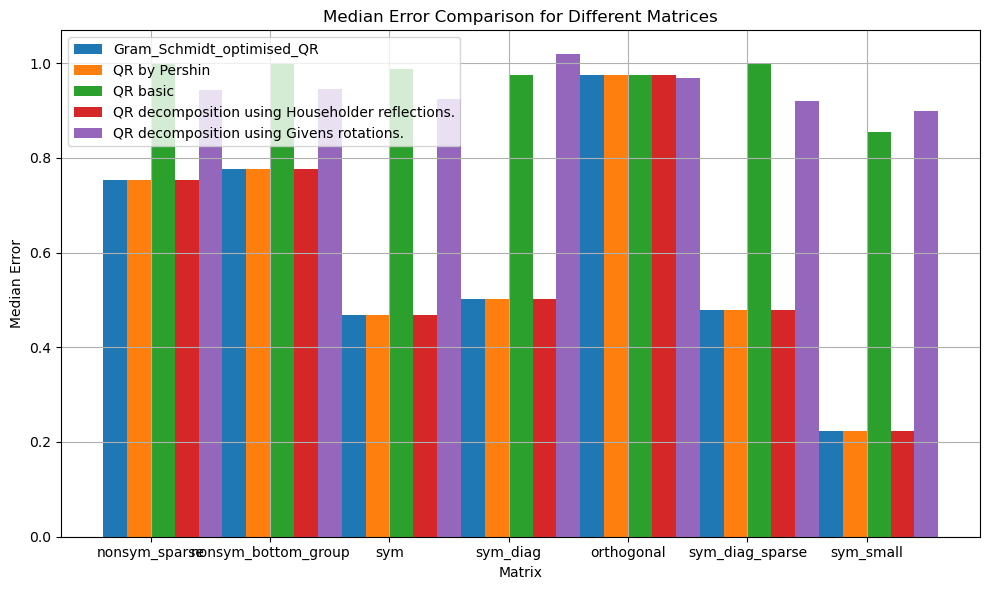
    
    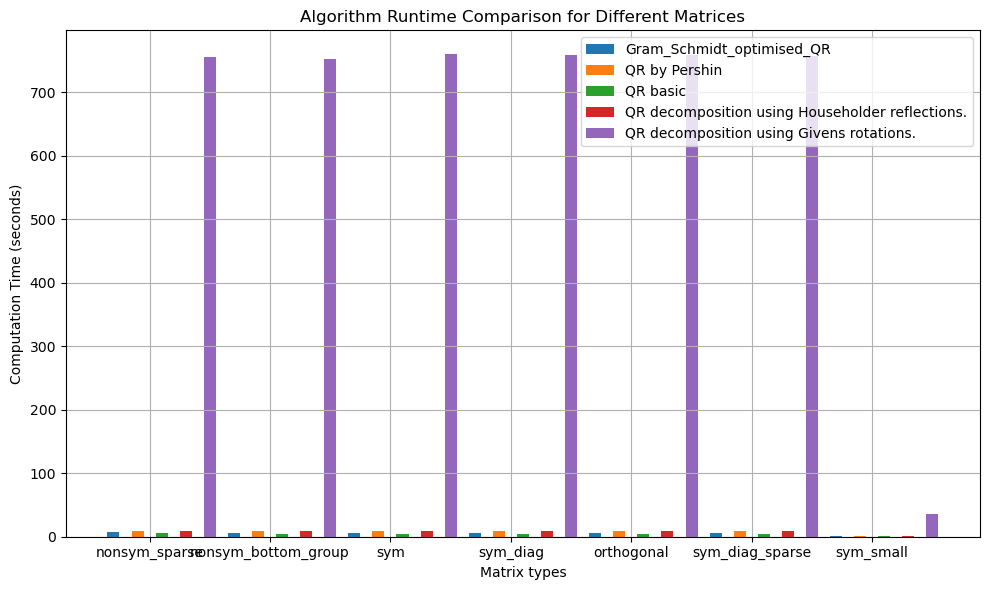
    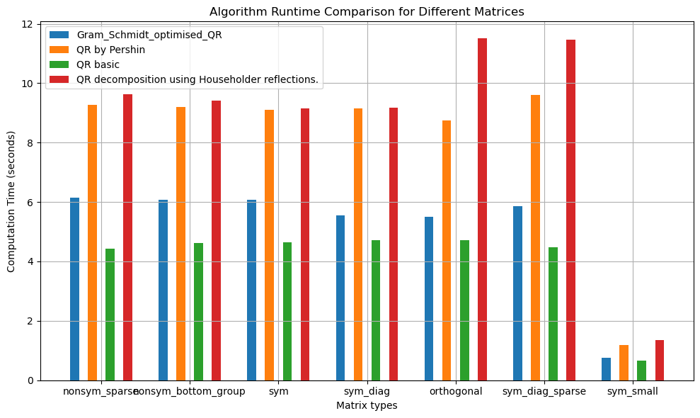

#### Выводы: наиболее оптимальными по точности и скорости решения являются 2 алгоримта: *Gram_Schmidt_optimised_QR* и *qr_householder*.

## 3) **method_vault.ipynb**
> Просто файл, который содержит **все** алгоритмы которые были протестированы

### Полный список:
    1) Jacobi method for real symmetric matrix
    2) Power Iteration method with deflation
    3) Basic Gram-Schmidt process with normalization
    4) QR algorithm with shifts for real symmetric matrix
    5) QR by pershin
    6) Optimized Gram-Schmidt process with normalization
    7) QR using householder matrices
    8) QR decomposition using Givens rotations
    9) Rayleigh Quotient Iteration for symmetric matrix

## 4) **eigenvalue_search_algorithms_testing.ipynb**

> файл в котором происходит более детальный тест определенного алгоритма. Файл позволяет узнать ошибку по каждому конекретному собственному числу, сравнить значение каждого собственного числа с numpy, узнать время работы алгоритма, его медианную и среднюю ошибки.

  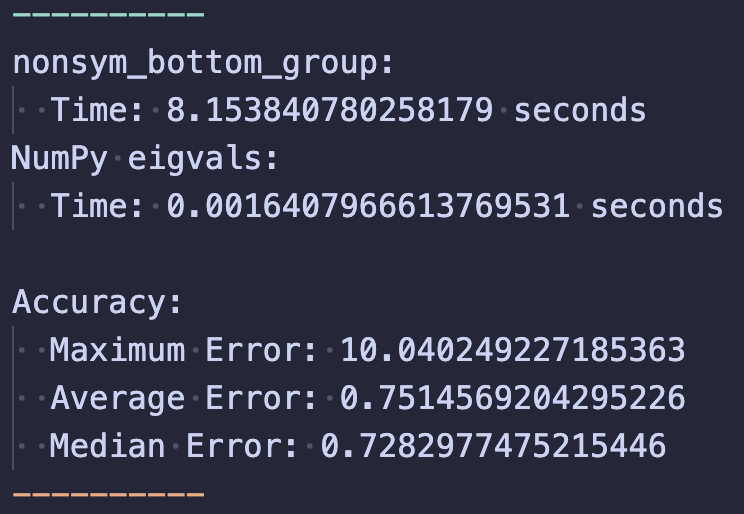
    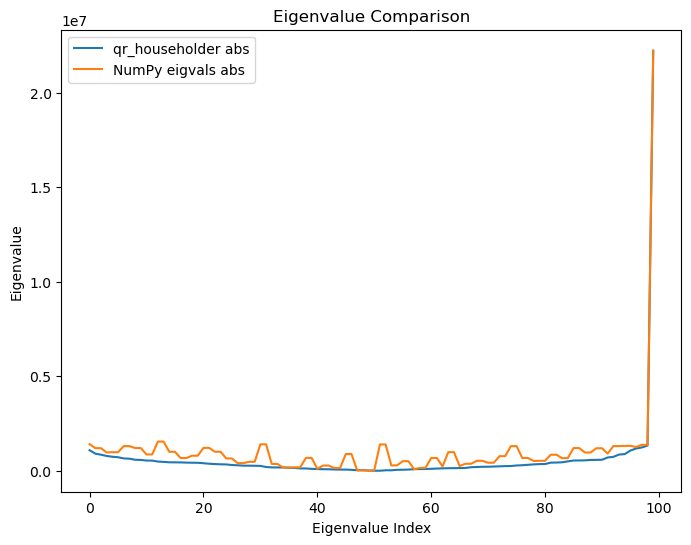
    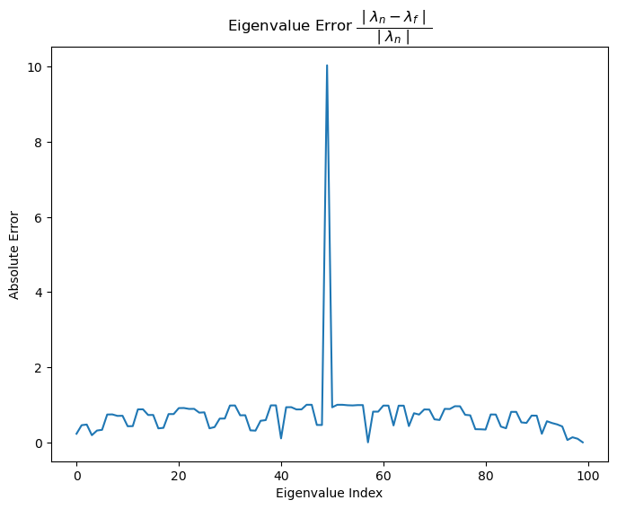
    

# Выводы

Как показала практика, единственными адекватными методами для матриц такой размерности являются алгоритмы основанные на QR-разложении. Их существует бесконечно много, поэтому нет какого-то одного лучшего. Поэтому для решения этой задачи был выбран **QR-алгоритм + QR-разложение через матрицы Хаусхолдера**

## P.S.
некоторые методы показали намного болюю точность при решении какой-то одной конкретной матрицы. Но из-за ограничения на сигнатуру функции и запрет изминений тестирующих функций не удалось реализовать механизм выбора определенного алгоритма под каждую матрицу

# Финальные результаты

Result summary:
Matrix: bp__1000.mtx.gz. Average time: 1.21e+02 seconds. Relative error: 7.88e-01

Matrix: e05r0100.mtx.gz. Average time: 8.20e+00 seconds. Relative error: 7.82e-02

Matrix: fs_541_1.mtx.gz. Average time: 4.91e+01 seconds. Relative error: 4.09e-04

Matrix: fs_680_1.mtx.gz. Average time: 7.75e+01 seconds. Relative error: 1.39e-08

Matrix: gre_1107.mtx.gz. Average time: 2.59e+02 seconds. Relative error: 7.27e-01

Matrix: hor__131.mtx.gz. Average time: 3.16e+01 seconds. Relative error: 4.26e-01

Matrix: impcol_c.mtx.gz. Average time: 2.62e+00 seconds. Relative error: 6.52e-01

Matrix: impcol_d.mtx.gz. Average time: 3.05e+01 seconds. Relative error: 8.21e-01

Matrix: impcol_e.mtx.gz. Average time: 7.46e+00 seconds. Relative error: 7.61e-01

Matrix: jpwh_991.mtx.gz. Average time: 2.10e+02 seconds. Relative error: 2.02e-03

Matrix: lns__511.mtx.gz. Average time: 4.51e+01 seconds. Relative error: 9.01e-01

Matrix: mahindas.mtx.gz. Average time: 3.61e+02 seconds. Relative error: 8.74e-01

Matrix: mcca.mtx.gz. Average time: 4.54e+00 seconds. Relative error: 8.35e-02

Matrix: mcfe.mtx.gz. Average time: 1.01e+02 seconds. Relative error: 5.10e-02

Matrix: nos5.mtx.gz. Average time: 3.52e+01 seconds. Relative error: 4.30e-03

Matrix: orsirr_1.mtx.gz. Average time: 2.16e+02 seconds. Relative error: 3.91e-02