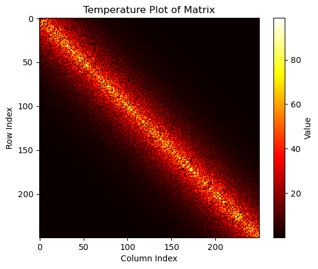
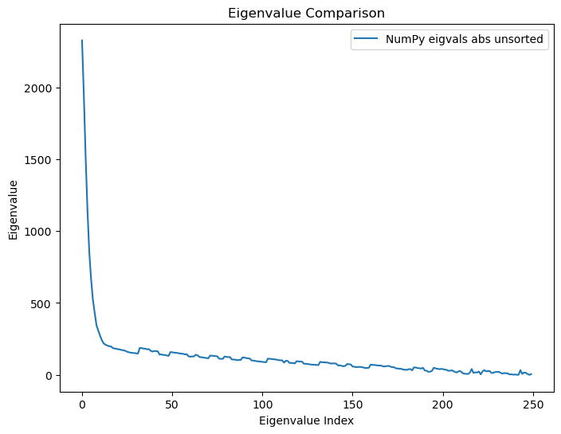
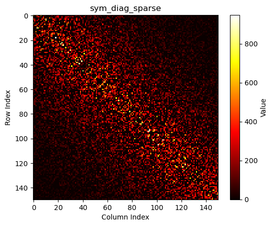

# Предназначение каждого файла

## 1) **testing_np_linalg_eig.ipynb**
>  Во время тестрирования своих алгоритмов, я построил график который показывал величину найденного собственного числа в соответстивии с его индексом. Была замечени странность - несколько чисел были в 1000-10000 раз больше всех остальных собственных чисел на практически любой исследуемой матрицей. Посоветовавшись с Дегятревым А.Б. и Утешевым А.Ю., я решил перепроверить правильность написания кода. Действительно, несколько собственных чисел большинства матриц (заданных случайно) по модулю больше на несколько порядков всего отсального множества. Данный файл подтверждает это наблюдение.
> 

  
  

## 2) **qr_algos_battle.ipynb**
> Во время первоначального тестирования, было обнаружено, что на больших матрицах алгоритмы, которые находят сразу все собственные числа работают лучше. Поэтому я решил болле подробно изучить QR-алгоритм, основной частью которого является QR-разложение. При изучении, было обнаружено 5 разных алгоритмов QR-разложения:
> 
>   1) Стандартный алгоритм ортогонализации Грама-Шмидта - *basic_QR*
>   2) Оптимизированный алгоритм ортогонализации Грама-Шмидта (основной задачей является предотвращение потери точности при процессе вычитания $\vec{u_i} - \sum_{j=1}^i \vec{u_j}$) - *Gram_Schmidt_optimised_QR*
>   3) Оптимизированный алгоритм ортогонализации Грама-Шмидта модификации Першина А.Ю. - *qr_pershin*
>   4) Метод Хаусхолдера (метод отражений) - *qr_householder*
>   5) QR-декомпозиция с помощью вращений по Гивенсу - *qr_givens*
>

### Матрицы, на которых прогонялись алгоритмы

  
    
    
    
    
    
    

### Результаты
